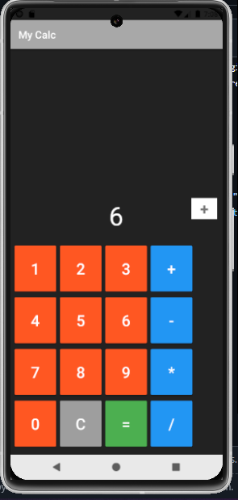

# 📱 Android Calculator App (Java)

A simple, clean, and functional calculator app built using Java for Android. This app performs basic arithmetic operations and provides a smooth button-based user interface — perfect for learning Android development fundamentals.

---

## 🚀 Features

- ✅ Addition, Subtraction, Multiplication, Division
- ✅ Responsive button-based number input
- ✅ Clean and minimal UI
- ✅ Toast messages on button click (for debugging)
- ✅ Built following modern Android architecture principles

---

## 📸 Screenshots

<!-- Replace with your actual screenshots -->

---

## 🛠️ Built With

- Java
- Android Studio
- XML Layouts
- Android SDK

---

## 📦 Getting Started

### Prerequisites

- Android Studio (Flamingo or later)
- Android SDK 30+
- Java JDK 8+

### Installation

1. Clone the repository:
   ```bash
   git clone https://github.com/lalitupadhyayy/Android-Calculator-App-java.git

## 📦 Download

🔽 **[Download the Latest APK](https://github.com/lalitupadhyayy/Android-Calculator-App-java/releases/latest)**  
📱 *Compatible with Android 8.0+ (API 26+)*  
📦 File size: ~17MB   
